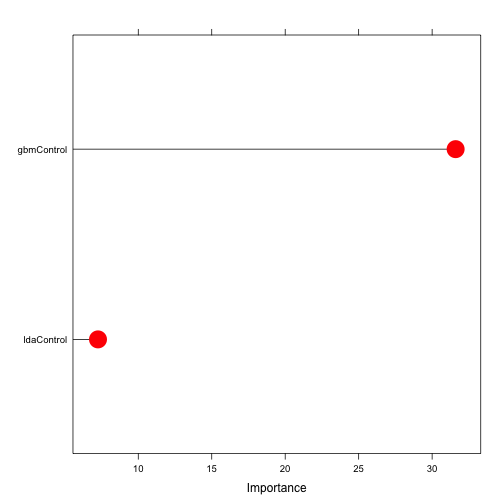

<style>

.reveal h4 {
    color: #00BFFF;
    padding-bottom: 10px;
    font-family: 'Helvetica', 'Arial', sans-serif;
}

.reveal h3 {
    color: #00BFFF;
    padding-bottom: 10px;
    font-family: 'Helvetica', 'Arial', sans-serif;
}

.reveal h2 {
    color: #00BFFF;
    padding-bottom: 10px;
    font-family: 'Helvetica', 'Arial', sans-serif;
}

.reveal p {
    font-family: 'Helvetica', 'Arial', sans-serif;
}

.reveal body {
    font-family: 'Helvetica', 'Arial', sans-serif;
}


</style>


## Ensebling Models

<br>

Using Shiny to test modeling settings

<br>
<br>

<small> Chad Junkermeier </small>


---
## Introduction
In the Courcera Practicle Machine Learning class ensembling of models was discussed briefly, this is where two or more models are used as the input of a new uber-model which will hopefully have the strengths of each of the input models and fewer of the deficits.  When I was trying to figure out how to do ensembling I noticed that with the data, modeling techniques, and settings that I used one of the models had a heavier weighting than the other, even though the other model suppposedly worked better according to other analysis.  This is a test to see if by changing a couple of the settings I can change the weighting so that the other model has the heavier weighting.


--- .codefont .outfont 

## Code used to produce plot


```
# Load libaries and data frame
library(caret)
library(AppliedPredictiveModeling)
data(AlzheimerDisease)
library(gbm)
library(e1071)
adData = data.frame(diagnosis,predictors)

# Set seed to seed1 and the 
set.seed(seed1)
smaller <- createDataPartition(y=adData$diagnosis, p=pv, list=FALSE)
SMALLER1.TRAINING <- adData[smaller,]
SMALLER2.TRAINING <- adData[-smaller,]

modFit1.gbm <- train(diagnosis ~ ., method="gbm", data=SMALLER1.TRAINING, verbose=FALSE)
modFit1.svm <- svm(diagnosis ~ .,data=SMALLER1.TRAINING)

predict2.gbm <- predict(modFit1.gbm, newdata=SMALLER2.TRAINING)
predict2.svm <- predict(modFit1.svm, newdata=SMALLER2.TRAINING)

predDF <- data.frame(lda=predict2.svm, gbm=predict2.gbm, diagnosis=SMALLER2.TRAINING$diagnosis)
combModFit <- train(diagnosis ~ ., method="gbm", data=predDF, verbose=FALSE)

plot(varImp(combModFit, scale=FALSE),lwd=2,cex=3,col="red",cex.axis = 2)
```


--- 

## Sample Plot

Using the code from the previous slide and setting seed1 = 123, and pv=0.33 produces the variable importance plot shown below. 




--- .codefont .outfont 
## Goat beat boxing

<br>

<video controls> 
  <source src=assets/img/Goatbeatbox.mp4 type=video/mp4>
 /video>

<br>

